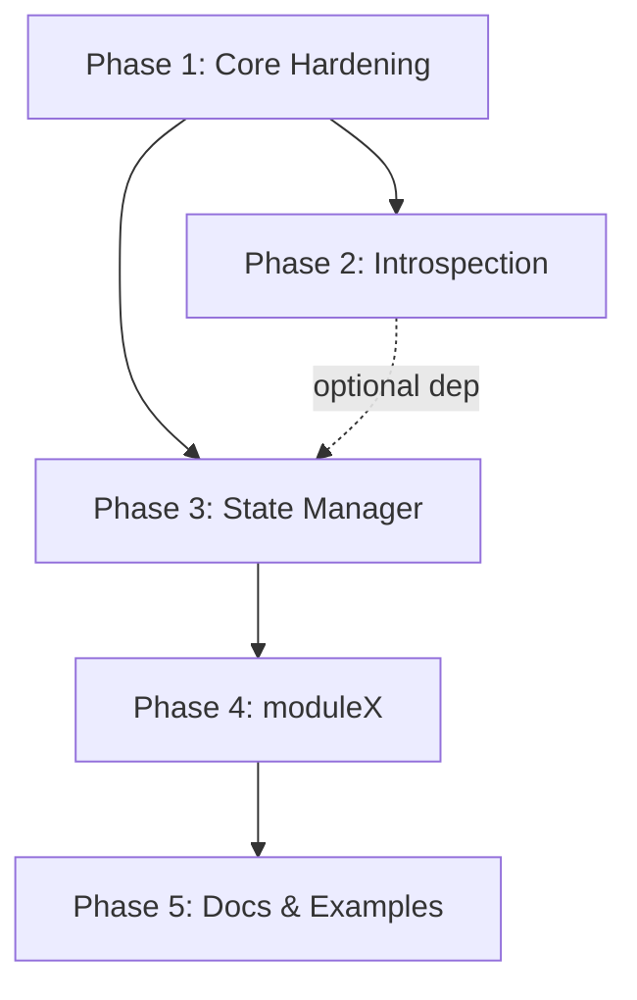

# Roadmap: godoo v1.0

## Overview

godoo v1 ships the four-layer async Python Odoo SDK: a hardened RPC client, a per-instance type generator, a Pythonic declarative state manager, and a live x-module builder. The layers are strictly ordered — each depends on the one before it. Phase 1 locks the client API; Phase 2 builds type generation on top; Phase 3 builds the state manager (which can start before Phase 2 finishes, because introspection is optional); Phase 4 builds moduleX on top of state-manager's pipeline; Phase 5 documents the whole stack.

## Phases

**Phase Numbering:**
- Integer phases (1, 2, 3): Planned milestone work
- Decimal phases (2.1, 2.2): Urgent insertions (marked with INSERTED)

Decimal phases appear between their surrounding integers in numeric order.

- [ ] **Phase 1: Core Hardening** - Audit and complete the existing client, lock the public API before downstream packages build against it
- [ ] **Phase 2: Introspection & Type Generation** - Replace the placeholder with a real per-instance type generator and CLI
- [ ] **Phase 3: State Manager** - Port the full TS state-manager DSL and 8-phase pipeline to Python
- [ ] **Phase 4: moduleX** - Live Studio-style x-module builder as a DSL layer over state-manager
- [ ] **Phase 5: Docs & Examples** - Per-package READMEs, top-level walkthrough, migration note

## Phase Dependency Diagram

```
Phase 1 (Core)
    │
    ├──── Phase 2 (Introspection)   ──────────────────────┐
    │                                                      │ optional dep
    └──── Phase 3 (State Manager)  ◄──────────────────────┘
               │
               └──── Phase 4 (moduleX)
                          │
                          └──── Phase 5 (Docs)
```

Mermaid version:


Note: Phase 3 can begin after Phase 1 is complete; it does not have to wait for Phase 2 to finish (introspection is an optional dependency of state-manager). Phase 4 requires a stable Phase 3 pipeline.

## Phase Details

### Phase 1: Core Hardening
**Goal**: The OdooClient public API is complete, correct, and frozen — every downstream package can build against it without risk of breakage
**Depends on**: Nothing (first phase)
**Requirements**: CORE-01, CORE-02, CORE-03, CORE-04, CORE-05, CORE-06, CORE-07, CORE-08, CORE-09, CORE-10, CORE-11, CORE-12, CORE-13, CORE-14, CORE-15
**Research needed**: No — all work is code audit + known RPC mechanics
**Success Criteria** (what must be TRUE):
  1. User can call `client.iter_search_read()` and get all records auto-paginated without manual offset management
  2. User can call `async with OdooClient(...) as client:` and have the session cleaned up on exit
  3. User can call `client.with_context(lang='fr_FR')` and all subsequent calls carry that context
  4. Every public method raises a named, actionable error subclass (not a raw RPC dict) when Odoo rejects the call
  5. All 8 existing domain services have at least one integration test passing against a real Odoo instance via testcontainers
**Plans**: 4 plans

Plans:
- [ ] 01-01: Infrastructure baseline — upgrade pytest-asyncio to >=1.0, validate full test suite, fix httpx lifecycle (CORE-09, CORE-14)
- [ ] 01-02: Client API completions — add context kwarg/with_context, iter_search_read, read_binary, fields_get, ref, execute_kw, bulk create, logout (CORE-01, CORE-02, CORE-03, CORE-04, CORE-05, CORE-06, CORE-07, CORE-08, CORE-10)
- [ ] 01-03: Error taxonomy + safety guard audit — verify all 7 error classes, async safety callback contract (CORE-12, CORE-13)
- [ ] 01-04: Integration tests for all 8 services + API freeze — write integration tests, document public API, tag freeze (CORE-11, CORE-15)

Parallelization: Plans 01-01 and 01-02 can run in parallel (infrastructure vs. API surface). Plans 01-03 and 01-04 follow sequentially.

### Phase 2: Introspection & Type Generation
**Goal**: Running `godoo-introspect --url ... --output ./types` against a live Odoo v17/v18 instance produces a pip-installable Python package with typed representations of every model, field, and property in that specific database
**Depends on**: Phase 1
**Requirements**: INTRO-01, INTRO-02, INTRO-03, INTRO-04, INTRO-05, INTRO-06, INTRO-07, INTRO-08, INTRO-09, INTRO-10, INTRO-11, INTRO-12
**Research needed**: Yes — v17+ Properties field schema location (`ir.model._properties_definition` or elsewhere) needs live-instance verification before INTRO-09 can be implemented
**Success Criteria** (what must be TRUE):
  1. User can run `godoo-introspect --url http://odoo --db mydb --user admin --password x --output ./types` and get a directory at `./types/` that is a valid Python package
  2. The generated package installs with `pip install ./types/` and passes `mypy --strict` on any file that imports from it
  3. Re-running the generator against the same instance produces byte-identical output (deterministic, git-diffable)
  4. Selection fields in the generated package use `Literal[...]` types, not bare `str`
  5. Unknown field types produce a warning on stderr and emit `Any`, not a crash
**Plans**: 4 plans

Plans:
- [ ] 02-01: Phase research — verify v17+ Properties schema location, inline translation JSON shape, markdown-it-py/css-inline mypy compatibility (research gate)
- [ ] 02-02: Core schema traversal — ir.model enumeration, ir.model.fields cross-reference for x_ customs, ttype mapping, graceful unknown-ttype fallback (INTRO-03, INTRO-06, INTRO-07, INTRO-08, INTRO-11)
- [ ] 02-03: Code generation pipeline — Jinja2 templates, TypedDict + dataclass output, relational typing, Properties support, instance fingerprint, CLI (INTRO-01, INTRO-02, INTRO-04, INTRO-05, INTRO-09, INTRO-12)
- [ ] 02-04: Determinism + integration tests — verify bit-identical reruns, pip-installable output validation, integration test against real Odoo via testcontainers (INTRO-10)

Parallelization: Plans 02-02 and early 02-03 (template scaffolding) can overlap. Plan 02-01 must complete before 02-02 to resolve the Properties open question.

### Phase 3: State Manager
**Goal**: Users can declare Odoo configuration state in `.py` files using a Pythonic DSL, then `plan/apply/diff` those declarations against a live Odoo instance — idempotently, with translation support, and with xml_id-tracked records that can be safely removed
**Depends on**: Phase 1 (Phase 2 optional — introspection degrades gracefully)
**Requirements**: STATE-01, STATE-02, STATE-03, STATE-04, STATE-05, STATE-06, STATE-07, STATE-08, STATE-09, STATE-10, STATE-11, STATE-12, STATE-13, STATE-14, STATE-15, STATE-16, STATE-17, STATE-18, STATE-19, STATE-20, STATE-21, STATE-22, STATE-23, STATE-24
**Research needed**: Yes — exact JSON shape of inline translations in v17 HTML fields needs live-instance verification before STATE-16 (Diff phase translation diffing) can be implemented
**Success Criteria** (what must be TRUE):
  1. User can write a `state.py` file using `resource()`, `lookup()`, `model_policy()`, and `translated()` helpers, then run `godoo-state apply ./state.py` and have Odoo updated correctly
  2. Re-running `apply` on an unchanged state produces no writes (idempotent)
  3. Every applied resource has an `ir.model.data` xml_id entry; removing it from the state file and running `apply` removes the record from Odoo
  4. `diff` output shows per-language translation changes on HTML fields, not just raw field-level diffs
  5. Running `godoo-state plan ./state.py` exits 0 with no output when state matches Odoo; exits 2 with a human-readable diff when changes are pending
**Plans**: 5 plans

Plans:
- [ ] 03-01: Phase research — verify inline translation JSON shape (v17 HTML fields), confirm ir.model.fields deletion cascade behavior (research gate)
- [ ] 03-02: DSL primitives — resource, lookup, model_policy, translated, md, md_file, with_css, html; new package scaffold with runtime deps (nh3, markdown-it-py, css-inline) (STATE-01 to STATE-11)
- [ ] 03-03: Pipeline core — Evaluate + Resolve + Introspect + Transform phases; importlib file loader; xml_id idempotency architecture from day one (STATE-12, STATE-13, STATE-14, STATE-15, STATE-22)
- [ ] 03-04: Pipeline output — Diff + Plan + Apply + Verify phases; ir.rule AST validation; per-language translation writes (STATE-16, STATE-17, STATE-18, STATE-19, STATE-24)
- [ ] 03-05: Public API + CLI — plan/apply/diff/format_plan functions; evaluate/resolve_lookups/domain_to_tuples helpers; typer CLI; integration tests (STATE-20, STATE-21, STATE-23)

Parallelization: Plans 03-02 (DSL primitives) and 03-03 (pipeline core) can be developed in parallel waves after 03-01 research completes. Plan 03-04 requires 03-03 pipeline architecture to be stable.

### Phase 4: moduleX
**Goal**: Users can declare a named logical "x-module" in Python — custom models, fields, views, menus, actions, ACLs, and record rules — and push it live into an Odoo instance via RPC, with idempotent re-runs and clean removal
**Depends on**: Phase 3 (stable pipeline; no parallel engine built)
**Requirements**: MODX-01, MODX-02, MODX-03, MODX-04, MODX-05, MODX-06, MODX-07, MODX-08, MODX-09, MODX-10, MODX-11, MODX-12, MODX-13, MODX-14, MODX-15, MODX-16
**Research needed**: Yes — FK deletion order correctness (`ir.model.fields` deletion cascading to dependent views) and `mail.thread` availability over RPC need live-instance verification before MODX-10 and the out-of-scope documentation can be finalized
**Success Criteria** (what must be TRUE):
  1. User can declare `XModule('my_module')` with a custom model, two fields, a form view, a menu, and an ACL, then call `module.push(client)` and have all records created in Odoo
  2. Re-running `module.push(client)` on an unchanged module produces no writes
  3. Calling `module.remove(client)` deletes all records in correct reverse order with no FK constraint errors
  4. `module.diff(client)` reports accurately when a field definition has changed and no false positives when nothing changed
  5. Every record pushed by moduleX has a stable `ir.model.data` xml_id traceable back to the module name
**Plans**: 4 plans

Plans:
- [ ] 04-01: Phase research — verify FK deletion order, mail.thread constraints, registry reload behavior under multi-worker Odoo (research gate)
- [ ] 04-02: XModule DSL — XModule class, x_model, x_field, view, menu, action, acl, record_rule declarations; ir.rule AST validation; state='manual' + x_ prefix enforcement; selection field serialization (MODX-01, MODX-02, MODX-03, MODX-04, MODX-05, MODX-06, MODX-07, MODX-08)
- [ ] 04-03: Push / remove / diff / list — dependency-ordered push, strict-reverse removal, drift detection, XModule.list; xml_id bookkeeping; registry reload warning; MODX-15 state-manager pipeline wiring (MODX-09, MODX-10, MODX-11, MODX-12, MODX-13, MODX-14, MODX-15)
- [ ] 04-04: Integration tests — create x-module (1 model + 2 fields + 1 view + 1 menu + 1 ACL), update a field, remove whole module, verify no orphans in ir.model.data (MODX-16)

Parallelization: Plans 04-02 and 04-03 can be split into parallel waves (DSL shape vs. execution engine) once 04-01 research is resolved.

### Phase 5: Docs & Examples
**Goal**: A developer landing on godoo for the first time can understand the four-layer value proposition, install the stack, and follow a working end-to-end example within 15 minutes
**Depends on**: Phase 4
**Requirements**: DOCS-01, DOCS-02, DOCS-03, DOCS-04, DOCS-05
**Research needed**: No — documentation only
**Success Criteria** (what must be TRUE):
  1. The top-level README explains the four-layer stack and per-instance typing value proposition with a working "hello Odoo" code snippet
  2. Each package (godoo, godoo-introspection, godoo-state-manager, godoo-moduleX) has its own README with install, quick start, and API surface
  3. An end-to-end walkthrough exists: generate types → declare a res.partner.category via state-manager → push an x-module with x_custom_field → verify with a typed query
  4. CHANGELOG.md reflects the v1 requirements as shipped
  5. TS odoo-state-manager users can find a migration note explaining the Pythonic equivalent of every TS primitive
**Plans**: 3 plans

Plans:
- [ ] 05-01: Package READMEs — godoo, godoo-introspection, godoo-state-manager, godoo-moduleX individual READMEs (DOCS-02)
- [ ] 05-02: Top-level README + end-to-end walkthrough — four-layer overview, hello-Odoo example, full composing walkthrough (DOCS-01, DOCS-03)
- [ ] 05-03: CHANGELOG + migration note — v1 CHANGELOG reflecting shipped requirements, TS→Python migration guide (DOCS-04, DOCS-05)

Parallelization: Plans 05-01 and 05-02 can run in parallel (per-package docs vs. top-level docs). Plan 05-03 follows after the other two.

## Progress

**Execution Order:**
Phases execute in numeric order: 1 → 2 → 3 → 4 → 5
Note: Phase 3 can begin immediately after Phase 1; it does not wait for Phase 2.

| Phase | Plans Complete | Status | Completed |
|-------|----------------|--------|-----------|
| 1. Core Hardening | 0/4 | Not started | - |
| 2. Introspection & Type Generation | 0/4 | Not started | - |
| 3. State Manager | 0/5 | Not started | - |
| 4. moduleX | 0/4 | Not started | - |
| 5. Docs & Examples | 0/3 | Not started | - |
