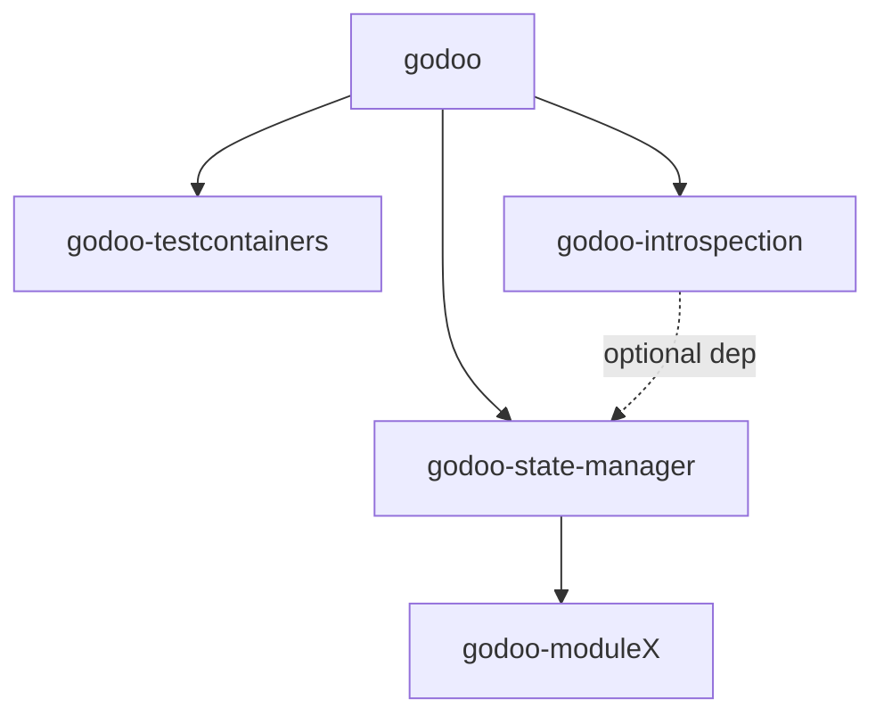

# Architecture Patterns

**Domain:** Async Python SDK for Odoo — 4-package layered stack
**Researched:** 2026-04-10

---

## 1. Package Dependency DAG

```
godoo (core)
  ├── godoo-testcontainers  [depends on: godoo]
  ├── godoo-introspection   [depends on: godoo]
  ├── godoo-state-manager   [depends on: godoo, godoo-introspection (optional)]
  └── godoo-moduleX         [depends on: godoo-state-manager]
```

Mermaid form:



**Acyclicity check:** Every edge points upward from core. No cycles.

### Dependency decisions with rationale

**godoo-state-manager → godoo-introspection (optional, not required)**

State-manager does NOT hard-depend on introspection. Rationale:

- Users can write state files with plain `str` model names and field dicts without generated types.
- Introspection provides field metadata for the `Introspect` phase but that phase can degrade gracefully (skip validation, warn instead of error).
- Making it optional lets state-manager ship and be usable before introspection is feature-complete.
- Implementation: `pyproject.toml` uses `[project.optional-dependencies]` with `introspection = ["godoo-introspection>=1.0"]`; the `introspect.py` module does `try: import godoo_introspection` and disables that pipeline phase if absent.

**godoo-moduleX → godoo-state-manager (hard dependency)**

moduleX re-uses state-manager's plan/apply/diff pipeline rather than owning a parallel one. Rationale:

- moduleX's 7 record types (ir.model, ir.model.fields, ir.ui.view, ir.ui.menu, ir.actions.act_window, ir.model.access, ir.rule) are just state-manager resources with a fixed dependency order baked in.
- Building a second pipeline for the same semantics (diff, plan, apply, verify) doubles the maintenance surface for a solo maintainer.
- The "x-module" concept is a grouping/tracking concern layered on top, not a different execution engine.
- moduleX depends on state-manager as a hard runtime dep: `godoo-state-manager>=1.0`.

**godoo-testcontainers → godoo (only)**

No change to existing relationship. testcontainers is test infrastructure; it does not need introspection or state-manager.

---

## 2. godoo-state-manager Module Layout

### How users write state definitions

**Answer: `.py` files with decorated functions, loaded via `importlib`.**

Users create a directory (e.g., `state/`) containing plain Python files:

```python
# state/partner_groups.py
from __future__ import annotations
from godoo_state_manager import resource, lookup, model, md

PARTNER_CATEGORY = model("res.partner.category")

external_partners = resource(
    PARTNER_CATEGORY,
    xml_id="myproject.partner_cat_external",
    name="External Partners",
    color=3,
)

parent_ref = lookup(
    "res.partner.category",
    domain=[("name", "=", "Top Level")],
)
```

The `resource()`, `lookup()`, `model()` calls return dataclass instances immediately — they are **not decorators** and not deferred. The file is a plain Python module that, when imported, registers its resources as a side effect via a module-level registry (thread-local context populated during evaluation). This is the same mechanism the TS DSL uses: evaluate by importing, collect as side effect.

**Why importlib, not exec, not entry points:**

- `exec()` loses type safety and IDE support; users can't get autocomplete on their state files.
- Entry points (`[project.entry-points]`) require users to package their state directory as a Python package and run `pip install -e .`, which is too heavy for a config directory.
- `importlib.util.spec_from_file_location` + `importlib.util.module_from_spec` loads arbitrary `.py` files without requiring installation, preserves type annotations, and works from any directory. Same pattern used by pytest, celery, and alembic for loading user config files.
- mypy can check user state files if they import from `godoo_state_manager` with proper stubs.

**Registry mechanism:**

```python
# dsl.py internals
_REGISTRY: list[Resource] = []

def resource(m: ModelRef, *, xml_id: str, **fields: Any) -> Resource:
    r = Resource(model=m, xml_id=xml_id, fields=fields)
    _REGISTRY.append(r)
    return r
```

`evaluate.py` sets up a fresh `_REGISTRY`, imports each file, then drains the registry. Files can import each other (Python's import machinery handles it); circular state deps are a user error caught at evaluate time.

### File layout

```
packages/godoo-state-manager/
  src/godoo_state_manager/
    __init__.py          # Public API: resource, lookup, model, plan, apply, diff, Plan, Result
    dsl.py               # resource(), lookup(), model() — DSL primitives returning dataclasses
    markers.py           # md(), mdFile(), translated(), withCss(), html() — content markers
    types.py             # Plan, Operation, Resource, Lookup, ModelRef, Drift, ApplyResult dataclasses
    evaluate.py          # importlib-based file loader; drains _REGISTRY; returns list[Resource]
    resolve.py           # batch lookup resolution via client.search_read; populates Lookup.resolved_id
    introspect.py        # optional field metadata cache; wraps godoo-introspection if present
    transform.py         # markdown→HTML, CSS inlining, translation extraction, sanitization
    diff.py              # desired vs actual: search_read current state, compare by xml_id
    plan.py              # Plan dataclass; operation ordering (topological sort on dependencies)
    apply.py             # executor: level-by-level create/write/unlink; error aggregation
    verify.py            # re-run diff after apply; emit Drift report
    cli.py               # typer CLI: `godoo-state plan`, `godoo-state apply`, `godoo-state diff`
    _registry.py         # module-level _REGISTRY list and context management (private)
  tests/
    test_dsl.py
    test_evaluate.py
    test_resolve.py
    test_diff.py
    test_plan.py
    test_apply.py
    test_cli.py
```

### Key type contracts

```python
# types.py (simplified)
@dataclass
class ModelRef:
    name: str  # "res.partner.category"

@dataclass
class Lookup:
    model: str
    domain: list[Any]
    resolved_id: int | None = None  # populated by resolve phase

@dataclass
class Resource:
    model: ModelRef
    xml_id: str
    fields: dict[str, Any]
    _lookup_refs: list[Lookup] = field(default_factory=list)  # populated at eval time

@dataclass
class Operation:
    level: int
    model: str
    action: Literal["create", "write", "unlink"]
    xml_id: str
    payload: dict[str, Any]
    warnings: list[str] = field(default_factory=list)

@dataclass
class Plan:
    operations: list[Operation]
    warnings: list[str]

    @property
    def is_empty(self) -> bool:
        return len(self.operations) == 0

@dataclass
class ApplyResult:
    applied: list[str]   # xml_ids
    failed: list[tuple[str, Exception]]
```

### Public API surface (mirrors TS toolbox)

```python
# __init__.py exports
async def plan(*, dir: Path, client: OdooClient) -> Plan: ...
async def apply(*, dir: Path, client: OdooClient) -> ApplyResult: ...
async def diff(*, dir: Path, client: OdooClient) -> list[Drift]: ...
def format_plan(plan: Plan) -> str: ...

# Lower-level (also exported for testing/composition)
def evaluate(dir: Path) -> list[Resource]: ...
async def resolve_lookups(resources: list[Resource], client: OdooClient) -> None: ...
```

### Phase ordering inside state-manager

```
evaluate(dir) → resolve_lookups(client) → [introspect(client)] → transform() → diff(client) → plan() → apply(client) → verify(client)
```

- `evaluate` is sync (pure file loading)
- `resolve_lookups`, `diff`, `apply`, `verify` are async (need client)
- `transform` is sync (pure data)
- `introspect` is async but optional; skipped if godoo-introspection not installed
- `plan` is sync (pure ordering logic)

---

## 3. godoo-introspection Module Layout

### Purpose

Point at an OdooClient, emit a typed Python package (one file per Odoo module) with dataclasses per model, `Literal`/`Enum` per selection field, and `Lookup[T]` helper types.

### File layout

```
packages/godoo-introspection/
  src/godoo_introspection/
    __init__.py          # Public API: introspect(), FieldMeta, ModelMeta
    client.py            # IntrospectionClient wrapping OdooClient with caching
    fetcher.py           # RPC calls: fields_get, ir.model.fields, ir.model (all async)
    schema.py            # ModelMeta, FieldMeta, SelectionOption dataclasses (pure data)
    codegen.py           # Jinja2 rendering: ModelMeta → Python source strings
    writer.py            # File system: write generated package to output_path
    templates/
      model.py.j2        # Jinja2 template for one model file
      __init__.py.j2     # Jinja2 template for package __init__
      module_init.py.j2  # Jinja2 template for per-odoo-module __init__
  tests/
    test_fetcher.py
    test_codegen.py
    test_writer.py
```

### Input/output contract

```python
async def introspect(
    client: OdooClient,
    *,
    output_path: Path,
    odoo_modules: list[str] | None = None,   # None = all installed
    overwrite: bool = True,
) -> IntrospectionResult: ...

@dataclass
class IntrospectionResult:
    models_written: int
    output_path: Path
    warnings: list[str]
```

### Output package structure

One Python package per Odoo module, one file per model:

```
{output_path}/
  __init__.py                  # re-exports all module packages
  sale/
    __init__.py                # re-exports SaleOrder, SaleOrderLine, ...
    sale_order.py              # @dataclass class SaleOrder: ...
    sale_order_line.py
  account/
    __init__.py
    account_move.py
    account_move_line.py
  res/
    __init__.py
    res_partner.py
    res_users.py
```

**Rationale for one-file-per-model:** Avoids single 50k-line monolith; allows targeted re-generation of one model; IDE navigation is natural.

**Re-run semantics:** `overwrite=True` (default) replaces all files in the output path. This is the only safe default — generated files should never be hand-edited. If users want to add custom fields on top, they import from the generated package and subclass. There is no additive/merge mode; partial regeneration is supported by passing `odoo_modules=["sale"]` to scope the run.

**Drift between generated schema and runtime schema:** No automatic detection. The generated package is a snapshot. Users are expected to re-run introspection when they upgrade Odoo or install new modules. A `--check` flag in the CLI can compare field counts and warn, but does not auto-update.

### Generated model format

```python
# sale/sale_order.py (generated)
from __future__ import annotations
from dataclasses import dataclass
from typing import Literal

SaleOrderState = Literal["draft", "sent", "sale", "cancel"]

@dataclass
class SaleOrder:
    id: int
    name: str
    state: SaleOrderState
    partner_id: int        # many2one → int (the id)
    order_line: list[int]  # one2many → list[int]
    amount_total: float
    # ... all fields from fields_get
```

**Decision:** Use `Literal` for selections (not `Enum`). Rationale: Literal is lighter, easier to use in `isinstance` checks, and avoids the `.value` dereferencing annoyance. If a field has >20 options, use `str` with a `TypeAlias` comment.

**Many2one fields:** Emit as `int` (the id) for the dataclass. The TS toolbox wraps these in a `Lookup[T]` type; in Python we skip that wrapper to keep generated code flat. Users who want the related record fetch it via `client.read()`.

### RPC calls used

- `fields_get(model, attributes=["string", "type", "selection", "relation", "required", "readonly"])` — per model
- `search_read("ir.model", [("state", "=", "base")], ["model", "name", "modules"])` — model list
- `search_read("ir.model.fields", [("model_id.model", "=", model)], ["name", "field_description", "ttype", "selection", "relation"])` — field list (more complete than fields_get for v17+)

---

## 4. godoo-moduleX Architecture

### Decision: re-use state-manager's plan/apply pipeline

moduleX does not own a pipeline. It is a **layer that emits state-manager resources** for the 7 Odoo meta-model types, adds a grouping/tracking mechanism, and delegates plan/apply/diff to state-manager.

Rationale:

- The 7 record types (ir.model, ir.model.fields, ir.ui.view, ir.ui.menu, ir.actions.act_window, ir.model.access, ir.rule) have exactly the desired-vs-actual semantics that state-manager implements.
- A bespoke pipeline would need to reimplement diff, plan, ordering, error aggregation, and dry-run — all of which state-manager already does.
- The only moduleX-specific logic is: (a) grouping records into a named "x-module", (b) enforcing creation order constraints, (c) providing a typed DSL for the 7 types.

### X-module identity and tracking

An x-module is identified by a **name prefix for xml_ids**. All resources in the module get xml_ids prefixed with `{module_name}.`. This is the standard Odoo convention and requires no separate registry table.

```python
# Example: defining an x-module
xmod = XModule(name="crm_ext", client=client)

crm_lead_ext = xmod.model(
    name="CRM Lead Extension",
    model="x_crm_lead_ext",
    fields=[
        xmod.char("x_lead_score", string="Lead Score"),
        xmod.integer("x_priority_level", string="Priority"),
    ]
)
```

xml_ids emitted: `crm_ext.model_x_crm_lead_ext`, `crm_ext.field_x_crm_lead_ext__x_lead_score`, etc.

**Why xml_id prefix, not a registry model:** Adding a custom `ir.module.module`-like table requires creating that table first (chicken-and-egg), adds a schema dependency, and complicates uninstall. The xml_id approach works with Odoo's built-in `ir.model.data` and is idempotent by default.

### File layout

```
packages/godoo-moduleX/
  src/godoo_modulex/
    __init__.py          # Public API: XModule, XModuleResult
    xmodule.py           # XModule class: .model(), .view(), .menu(), .action(), .acl(), .rule()
    dsl.py               # Typed builders: XField, XView, XMenu, XAction, XAcl, XRule dataclasses
    ordering.py          # Creation order constraints: models→fields→views→menus→actions→acls→rules→data
    resources.py         # Converts XModule definitions → list[Resource] for state-manager
    cli.py               # typer CLI: `godoo-modulex push`, `godoo-modulex list`, `godoo-modulex remove`
  tests/
    test_xmodule.py
    test_ordering.py
    test_resources.py
```

### XModule public API

```python
@dataclass
class XModule:
    name: str
    client: OdooClient

    def model(self, *, name: str, model: str, fields: list[XField]) -> XModelDef: ...
    def view(self, *, model: str, view_type: str, arch: str) -> XViewDef: ...
    def menu(self, *, name: str, parent: str | None, action: str) -> XMenuDef: ...
    def action(self, *, name: str, model: str) -> XActionDef: ...
    def acl(self, *, model: str, group: str, perm_read: bool, ...) -> XAclDef: ...
    def rule(self, *, name: str, model: str, domain: list[Any]) -> XRuleDef: ...

async def push(xmod: XModule) -> ApplyResult: ...        # plan + apply
async def remove(xmod: XModule) -> ApplyResult: ...       # reverse-order unlink
async def list_modules(client: OdooClient) -> list[str]: ...  # scan ir.model.data for x_ prefixes
```

### Creation order constraints

Enforced in `ordering.py` by assigning levels to resource types, which feeds into state-manager's `plan.py` level-based executor:

```
Level 1: ir.model             (models must exist before fields)
Level 2: ir.model.fields      (fields before views can reference them)
Level 3: ir.ui.view           (views before menus reference them)
Level 4: ir.ui.menu           (menus before actions can bind them)
Level 5: ir.actions.act_window
Level 6: ir.model.access      (ACLs after model exists)
Level 7: ir.rule              (rules after model and ACLs)
Level 8: data records         (seed data after schema is complete)
```

Deletion order is the reverse (level 8 → 1).

---

## 5. How the 4 Layers Compose

### Minimum viable: core client + state-manager only

```python
from pathlib import Path
import asyncio
from godoo import OdooClient, OdooClientConfig
from godoo_state_manager import plan, apply, format_plan

async def main() -> None:
    client = OdooClient(OdooClientConfig(...))
    await client.authenticate()
    p = await plan(dir=Path("state/"), client=client)
    print(format_plan(p))
    result = await apply(dir=Path("state/"), client=client)

asyncio.run(main())
```

No type generation required. State files use plain dicts/strings. This is a complete and useful product on its own.

### Full stack: all four together

```python
from godoo_introspection import introspect
# Generate types once
await introspect(client, output_path=Path("odoo_types/"), odoo_modules=["sale", "account"])

# State files can now import generated types for IDE autocomplete
# from odoo_types.sale.sale_order import SaleOrder

# moduleX with type hints
from godoo_modulex import XModule, push
xmod = XModule(name="my_ext", client=client)
xmod.model(...)
await push(xmod)
```

### Can moduleX work without state-manager? No.

moduleX is a thin DSL layer that emits resources to state-manager. It has no apply engine of its own. This is a hard dependency.

### Can state-manager work without introspection? Yes.

The `introspect` phase in state-manager's pipeline degrades gracefully:

- If `godoo-introspection` is not installed: skip field validation, emit a single warning per resource type, continue to diff/plan/apply.
- If installed: validate field names, types, and required constraints before diff.

### Integration points with existing 8 services

State-manager and moduleX consume `OdooClient` directly via the same CRUD helpers already on the client:

| State-manager need | Core client method | Status |
|--------------------|--------------------|--------|
| Read current state by xml_id | `client.search_read("ir.model.data", ...)` | Exists (generic search_read) |
| Create records | `client.create(model, vals)` | Exists |
| Update records | `client.write(model, ids, vals)` | Exists |
| Delete records | `client.unlink(model, ids)` | Exists |
| Batch read for diff | `client.search_read(model, domain, fields)` | Exists |
| Translate: `write_translations` | `client.call("ir.translation", ...)` | Needs to be added (see §6) |

---

## 6. Core Client Hardening Required

### New core features state-manager needs

**Batch search_read with no arbitrary limit**

Current `client.search_read()` likely has a default `limit` that truncates results. State-manager's diff phase needs to read ALL current records for a model/xml_id set. Required: either remove the limit cap or add a `search_read_all()` that pages automatically.

Recommendation: add `async def search_read_all(model, domain, fields) -> list[dict[str, Any]]` that loops with offset until empty batch. This is a small addition with no breaking change.

**Translation write helper**

The `ir.translation` model is needed for state-manager's translated() marker. The existing `properties` service may partially cover this, but a dedicated `client.call("ir.translation", "translate_fields", ...)` helper should be documented and tested against real Odoo.

**Context manipulation**

Some Odoo RPC calls need `context` params (e.g., `{"lang": "es_ES"}` for translation reads, `{"tracking_disable": True}` for bulk writes). Currently unclear if context injection is exposed on `OdooClient.call()`. Required: `client.with_context(**ctx)` returning a context-scoped client or a `context` param on `call()`.

Recommendation: add `context: dict[str, Any] | None = None` to `client.call()` signature, forwarded to the RPC params.

**Error aggregation (non-fatal apply)**

State-manager's apply phase should continue after a single-record failure and collect errors. This is not a transport-level concern but an apply-level concern in state-manager itself — no changes needed to core client. Apply catches `OdooError` per operation and accumulates into `ApplyResult.failed`.

**xml_id resolution helper**

State-manager needs to resolve `xml_id` strings (e.g., `"base.res_partner_1"`) to database ids. Current client may not have `client.ref(xml_id) -> int`. Required: add `async def ref(xml_id: str) -> int` that calls `ir.model.data.xmlid_to_res_id`. This is a small utility method.

### Summary of additions to godoo core

| Addition | Priority | Breaking? |
|----------|----------|-----------|
| `search_read_all()` auto-paging | High | No |
| `ref(xml_id)` method | High | No |
| `context` param on `call()` | Medium | No (new optional param) |
| Translation write documentation + test | Medium | No |

---

## Component Boundary Summary

```
User state files (.py)
       │ importlib
       ▼
godoo-state-manager
  evaluate → resolve → [introspect] → transform → diff → plan → apply → verify
       │                    │                        │               │
       │              godoo-introspection        godoo (core)   godoo (core)
       │              (optional)                 search_read    create/write/unlink
       │
godoo-moduleX (sits above state-manager, emits Resources to it)
  XModule.model/view/menu/... → resources.py → list[Resource]
                                    │
                                    ▼
                          godoo-state-manager pipeline
```

---

## Anti-Patterns to Avoid

### Anti-Pattern 1: Sync wrappers anywhere in the new packages

State-manager, introspection, and moduleX are all async. No `asyncio.run()` wrappers inside library code. Callers handle the event loop.

### Anti-Pattern 2: exec() for loading user state files

Use importlib. exec() breaks IDE support, TYPE_CHECKING, and mypy.

### Anti-Pattern 3: moduleX owning a parallel apply pipeline

All apply logic lives in state-manager. moduleX contributes resources and ordering; state-manager executes.

### Anti-Pattern 4: Hard-coding creation order in state-manager

Creation order is a moduleX concern (it knows the 7 types and their dependencies). State-manager's plan.py uses a generic `level` field on `Operation` — the level values are assigned by the caller (moduleX for meta-model types, user-defined for arbitrary resources).

### Anti-Pattern 5: Generated introspection types in the same package as introspection tool

The output of `godoo-introspection` is a user-project artifact written to a path the user specifies. It is NOT bundled inside the `godoo-introspection` package. The tool generates; the user owns the output.

---

*Architecture: 2026-04-10 | Confidence: HIGH (based on existing codebase conventions + TS reference)*
